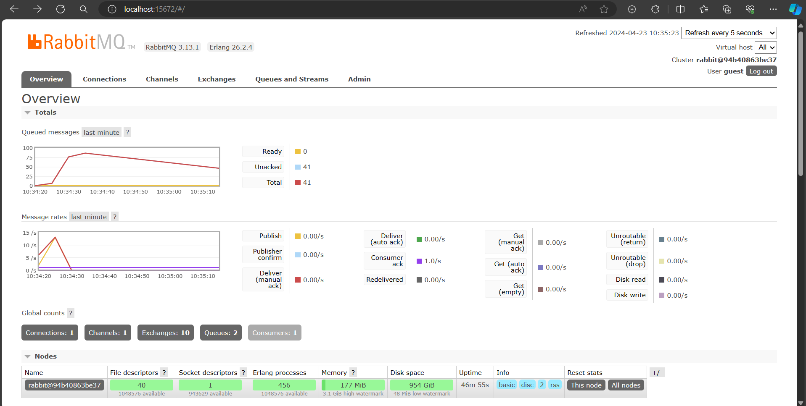
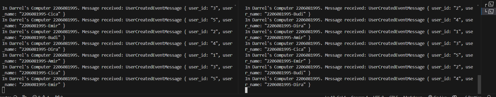
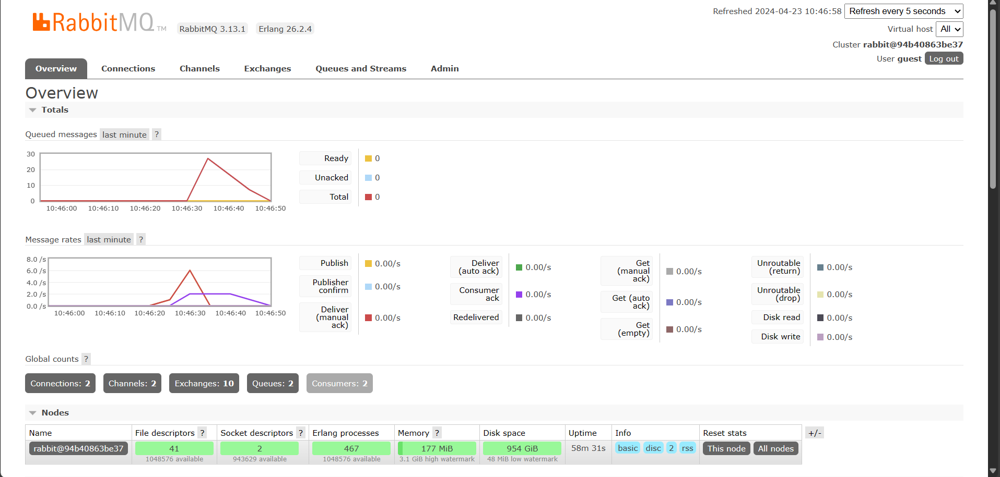

amqp is abbreviation for _Advanced Message Queuing Protocol_. It is an open standard application layer protocol for message-oriented-middleware.

On `guest:guest@localhost:5672`, `guest:guest` is username and password for the server. Secondly, `localhost` part tells us where does the server run. In this cas, we are running at localhost. Lastly, `5672` is the port where the server is listening. In this case, the localhost is listening on 5672.

Here, we tried to simulate delay process.

Remember that everytime we `cargo run` Publisher, we hit it with 5 messages. These are the number being processed as you can see on the screenshot.

We run multiple instance of Subscriber. That make our process goes down faster.
